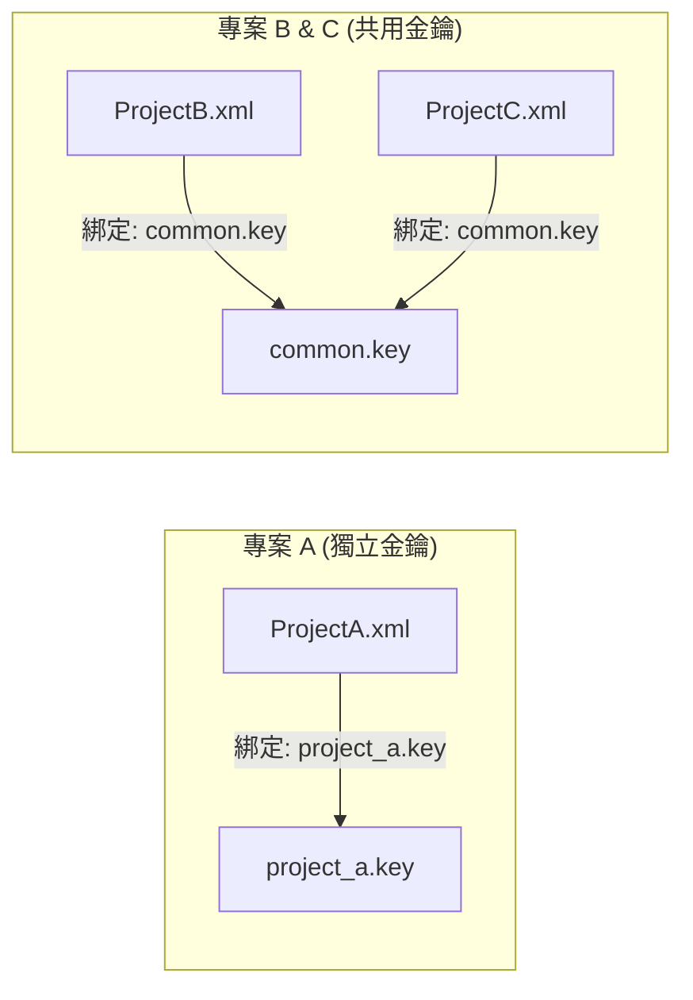

# 憑證金鑰部署與架構指南 (Master Key Deployment Guide)

本文件詳細說明 **PowerShell 集中式憑證管理工具** 的核心架構、多金鑰管理機制，以及在 Windows、Linux、Docker 與 Kubernetes (K8s) 環境中的部署實戰。

---

## 1. 核心架構：XML 綁定 Key

為了支援多專案隔離與靈活的金鑰管理，本工具採用 **「設定檔內嵌 (Metadata)」** 與 **「伴隨原則 (Side-by-Side)」**。

### 1.1 運作原理
*   **多 XML 支援**：您可以建立多個 XML 檔案（如 `ProjectA.xml`, `Common.xml`）。
*   **綁定關係 (`_StoreConfig`)**：
    每個 XML 檔案內部都有一個隱藏設定 `_StoreConfig`，記錄了它**專屬的 Key 檔名**。程式讀取 XML 時，會自動去讀取該 Key。
*   **欄位結構**：
    *   `Identity` (身分識別): 帳號或識別標籤 (若無則為 N/A)。
    *   `Value` (機敏內容): 加密後的密碼、API Key 或 Token。

### 1.2 架構圖解


---

## 2. 部署實戰 (Deployment Scenarios)

### 2.1 Windows Server 部署
適用於：**地端排程伺服器**、**開發機**。

1.  **準備檔案**：
    將開發端產生的 `Data/` 目錄內容複製到伺服器（例如 `C:\OpsTools\CredentialManager\Data\`）。
    *   包含：所有的 `.xml` 與對應的 `.key` 檔案。
2.  **執行權限設定 (ACL)**：
    *   **重要**：為了防止其他使用者竊取 Key，請務必設定 NTFS 權限。
    *   對 `.key` 檔案：**停用繼承**，僅允許 `SYSTEM`, `Administrators`, 以及**執行腳本的 Service Account** 擁有「讀取」權限。

### 2.2 Linux Server 部署
適用於：**Linux VM**、**Ansible 控制節點**。

1.  **傳輸檔案**：
    ```bash
    scp ./Data/* user@linux-server:/opt/scripts/Data/
    ```
2.  **權限設定 (chmod)**：
    將 Key 檔案設為僅擁有者可讀 (600)。
    ```bash
    chmod 600 /opt/scripts/Data/*.key
    chown script-user:script-group /opt/scripts/Data/*.key
    ```
3.  **驗證**：
    切換為 script-user 執行 `pwsh` 測試讀取。

### 2.3 Docker 容器部署
適用於：**單機容器**、**GitLab CI Runner**。

#### 方式 A：Volume Mount (推薦)
最簡單且符合架構的做法，直接將宿主機的 Data 目錄掛載進去。
```bash
docker run -d \
  -v $(pwd)/Data:/app/Data:ro \
  my-automation-image
```
*   優點：支援多 Key 架構，XML 會自動找到對應的 Key。
*   缺點：需管理宿主機檔案。

#### 方式 B：環境變數注入 (`PS_MASTER_KEY`)
若容器內只需要運行**單一專案**，或者您不想掛載實體檔案，可以使用環境變數覆寫金鑰。
*   **機制**：當 `$env:PS_MASTER_KEY` 存在時，程式會**無視** XML 內的檔名設定，強制使用此變數值解密。
*   **設定**：
    1.  取得 Key 內容 (Base64 字串): `cat project.key`
    2.  啟動容器:
        ```bash
        docker run -e PS_MASTER_KEY="u8x/9sL..." my-image
        ```
*   ⚠️ **限制**：若容器內有多個 XML 且使用**不同**的 Key，此方法會失敗（因為變數只有一個值）。

### 2.4 Kubernetes (K8s) 部署
適用於：**正式生產環境**。

#### 步驟 1: 建立 Secret
將 Key 檔案轉為 K8s Secret。
```bash
# 從檔案建立 (保留檔名，推薦用於多 Key 情境)
kubectl create secret generic cred-keys \
  --from-file=common.key=./Data/common.key \
  --from-file=project_a.key=./Data/project_a.key
```

#### 方式 A：掛載成檔案 (推薦)
推薦使用 **Projected Volume** 或單純的 **Volume Mount**，將 Secret 掛載回原本的路徑結構。

```yaml
apiVersion: v1
kind: Pod
metadata:
  name: automation-job-file
spec:
  containers:
  - name: script-runner
    image: my-automation-image
    volumeMounts:
    - name: secret-keys-vol
      mountPath: "/app/Data"      # 掛載到 Data 目錄
      readOnly: true
  volumes:
  - name: secret-keys-vol
    secret:
      secretName: cred-keys       # 對應上面的 Secret 名稱
```
*   **結果**：容器內的 `/app/Data/` 目錄下會出現 `common.key` 與 `project_a.key`，XML 檔案讀取時就能自動找到它們。

#### 方式 B：注入成環境變數 (Env Var)
適用於：**單一專案** 或 **簡化架構**。
若該 Pod 只需要讀取一組特定的 XML，且您希望由外部注入 Key 而非掛載檔案。

```yaml
apiVersion: v1
kind: Pod
metadata:
  name: automation-job-env
spec:
  containers:
  - name: script-runner
    image: my-automation-image
    env:
    - name: PS_MASTER_KEY  # 程式會優先讀取此變數
      valueFrom:
        secretKeyRef:
          name: cred-keys
          key: common.key  # 指定要用哪一把鑰匙
```
*   **注意**：一旦設定此變數，程式將會用這把 Key 去嘗試解密**所有** XML 檔案。若您的環境同時混用多個不同 Key 的 XML，請勿使用此方式。

### 2.5 K8s Secret 安全性重要觀念 (Security Note)
將檔案轉為 K8s Secret 主要是為了 **「管理隔離」** 與 **「權限控制」**，並不代表資料預設已被加密保護。

1.  **預設僅為 Base64 編碼 (Encoding ≠ Encryption)**：
    *   標準 K8s 的 Secret 存在 etcd 資料庫時僅做 Base64 編碼。若攻擊者能存取 etcd，即可輕易還原出 `master.key`。
2.  **建議開啟靜態加密 (Encryption at Rest)**：
    *   **雲端環境**：若使用雲端託管 K8s (EKS, GKE, AKS)，請務必開啟 **Secret Encryption** (通常搭配 KMS)。這項功能會在 Secret 寫入 etcd 資料庫前，使用另一把鑰匙進行 AES 加密。
    *   **地端環境 (On-Premises)**：
        *   **入門方案 (Secretbox)**：設定 K8s 的 `EncryptionConfiguration` 並使用 `aescbc` 模式。這不需要外部伺服器，只需在 Master Node 存放一把靜態 AES 金鑰即可提供基本的落地保護。
        *   **企業方案 (Vault)**：整合 **HashiCorp Vault** 作為 KMS Provider。這是地端環境的資安首選，支援金鑰輪替、詳細稽核與硬體加密模組 (HSM) 整合。
3.  **記憶體掛載優勢**：
    *   即使未開啟靜態加密，使用 Secret 掛載仍優於將 Key 放在 Image 內。因為 Secret 掛載至 Pod 時是存在於 **記憶體 (tmpfs)** 中，Pod 關閉即消失，不會寫入節點的實體硬碟。

---

## 3. 故障排除 (Troubleshooting)

### Q1: 錯誤 "找不到 Master Key 檔案: xxxx.key"
*   **原因**：XML 檔案預期在同目錄下找到 `xxxx.key`，但檔案不存在。
*   **檢查**：
    1.  確認部署時是否遺漏了 `.key` 檔案。
    2.  確認是否在部署過程中擅自改了 `.key` 的檔名（XML 內紀錄的是舊檔名）。

### Q2: 我改了 Key 檔名，結果讀不到了
*   **解法**：XML 內部的 `_StoreConfig` 寫死了 Key 檔名。
    *   **方法一 (推薦)**：把檔名改回去。
    *   **方法二 (進階)**：使用 `Manage-Secrets.ps1` 以外的編輯器手動修復 XML，或刪除 XML 重新建立。

### Q3: 環境變數 `PS_MASTER_KEY` 沒生效？
*   **檢查**：
    1.  確認變數名稱完全正確（區分大小寫）。
    2.  確認內容是純 Base64 字串，不要包含引號或額外的空白。
    3.  請注意：一旦設定此變數，**所有** XML 的讀取都會嘗試使用這把鑰匙。

---

## 4. 安全性檢查 (Security Checklist)
*   [ ] **Git Ignore**: 確保 `*.key` 與 `*.xml` (若含真實數據) 已加入 `.gitignore`。
*   [ ] **最小權限**: 生產環境的 Key 檔案應設為唯讀 (ReadOnly)。
*   [ ] **金鑰輪替**: 建議定期更換 Key。
    *   流程：建立新 XML (新 Key) -> 轉移資料 -> 部署新檔。

---

## 5. 進階安全：金鑰綁定與本地鎖 (Key Binding)

為了防止 `master.key` 被惡意複製到其他環境使用，我們可以實施 **「金鑰綁定」**。這相當於給通用的鑰匙加了一道「本地鎖」，使其只能在特定的機器或環境下生效。

### 5.1 為什麼需要綁定？
預設的 `master.key` 是通用的 Base64 字串。若攻擊者取得此檔案與 XML，即可在任何電腦上解密。
透過綁定，即使檔案被竊取，攻擊者因缺乏「環境特徵 (Machine Secret)」，檔案將變成無法讀取的廢物。

### 5.2 方案 A：作業系統原生鎖 (OS Native)
不需要修改程式碼，直接利用作業系統提供的檔案加密功能。

#### Windows: EFS (Encrypting File System)
*   **做法**：在 `master.key` 檔案上點擊右鍵 -> `內容` -> `進階` -> 勾選 **[加密內容，保護資料]**。
*   **效果**：檔案在磁碟上被加密，只有**目前登入的使用者**可以讀取。若被複製到 USB 或其他電腦，將無法開啟。
*   **優點**：簡單、無需工具支援。
*   **缺點**：僅限 Windows NTFS。

#### Linux: fscrypt (Filesystem Encryption)
*   **做法**：在 `/Data` 目錄啟用 fscrypt，並綁定至使用者的登入密碼或 TPM。
*   **效果**：類似 EFS，未登入或未解鎖 Keyring 時，檔案內容為亂碼。

### 5.3 方案 B：程式化綁定 (Programmatic Binding)
由本工具提供（或是您自行實作）的加密邏輯，將 Key 內容轉換為綁定格式。

*   **原理**：
    *   `Raw Key` + `Machine ID` (Linux) or `DPAPI` (Windows) -> `Bound Key`
*   **特徵來源**：
    *   **Windows**: 使用 `CryptProtectData` (DPAPI)，綁定當前使用者與電腦。
    *   **Linux**: 讀取 `/etc/machine-id` (每台 Linux 安裝時獨有的 UUID) 作為加密金鑰。
*   **優點**：跨平台一致性，檔案就算被 Root 複製走，拿到別台機器也解不開（因為 Machine ID 不同）。

### 5.4 方案 C：雲端信封加密 (Cloud KMS)
適用於 AWS/Azure/GCP 環境。

*   **做法**：
    1.  使用雲端 KMS CLI (如 `aws kms encrypt`) 將 `master.key` 加密成 `master.key.enc`。
    2.  程式啟動時，呼叫 KMS API 解密至記憶體。
*   **效果**：解密權限綁定於機器的 IAM Role，完全不依賴實體檔案的保護，安全性最高。